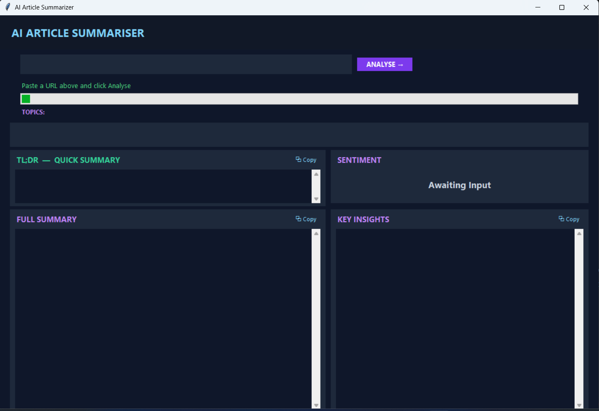
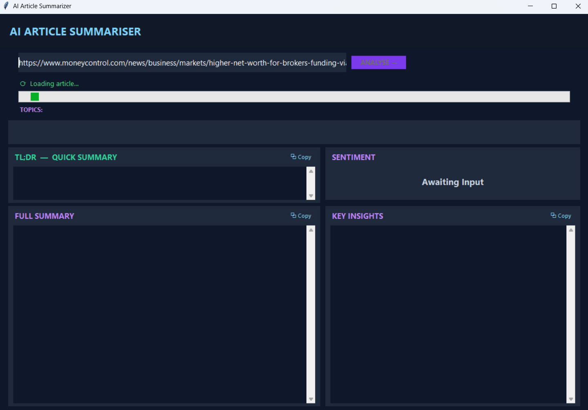
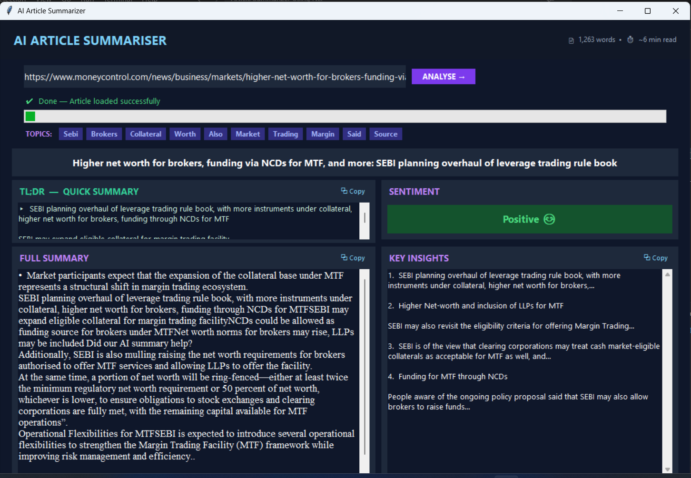

# Article-summarizer-NLP
This python project uses NLP to extract, parse &amp; summarize article

# 🧠 NLP Article Summarizer

A modern **Article Summarizer GUI Application** built completely in **Python** using **Natural Language Processing (NLP)** techniques to generate concise and meaningful summaries from lengthy articles or text.

<p align="center">
  
  
  
</p>

---

## ✨ Features

-  Summarizes long articles instantly
-  Uses **Natural Language Processing (NLP)** techniques
-  Simple and interactive Python GUI
-  Fast and lightweight application
-  Supports large text input
-  Generates concise and readable summaries

---

## 🚀 Tech Stack

| Technology | Purpose |
|------------|---------|
| Python | Core Programming Language |
| Tkinter | GUI Development |
| NLP | Text Processing & Summarization |
| NLTK / spaCy | Natural Language Processing |
| Scikit-learn | Text Vectorization & Processing |

---

## 📸 Preview

<p align="center">
  
</p>

---

<p align="center">
  
</p>

---

<p align="center">
  
</p>

---

## 🧠 How It Works

The application uses **Natural Language Processing (NLP)** to:

1. Tokenize the article text
2. Remove stopwords and unnecessary characters
3. Analyze sentence importance
4. Rank sentences based on relevance
5. Generate a concise summary

---

## 📂 Project Structure

```bash
nlp-article-summarizer/
│
├── article_summarizer.py
├── requirements.txt
├── README.md
└── images/
```

---

## ⚙️ Installation

Clone the repository:

```bash
git clone https://github.com/RohitMor3/Article-summarizer-NLP.git
```

Move into the project directory:

```bash
cd Article-summarizer-NLP
```

Install dependencies:

```bash
pip install -r requirements.txt
```

Run the application:

```bash
python article_summarizer.py
```

---

## 📌 Future Improvements

-  URL-based article summarization
-  AI Transformer-based summarization
-  Dark mode GUI
-  Export summary as PDF or TXT
-  Voice-based summarization

---

## 🤝 Contributing

Contributions are welcome!

Feel free to fork this repository and submit a pull request.

---

## 📜 License

This project is licensed under the MIT License.

---

## ⭐ Support

If you liked this project, consider giving it a ⭐ on GitHub!

---

<p align="center">
  Made with ❤️ using Python & NLP
</p>
